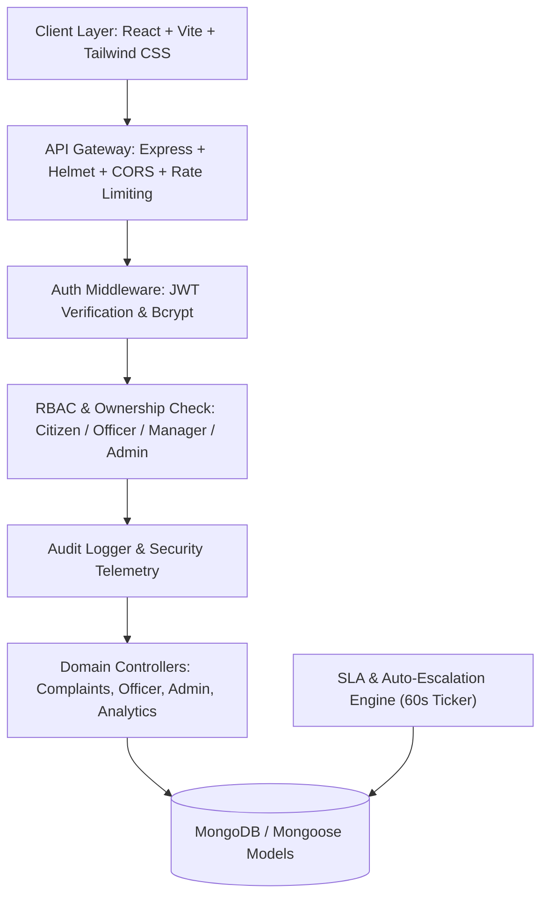
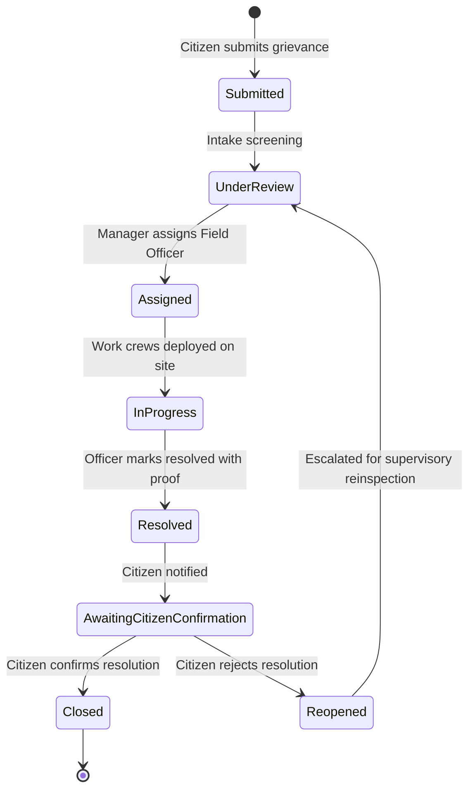

# CivicShield – Secure Civic Complaint & Municipal Management Portal

CivicShield is a full-stack, enterprise-grade, secure civic grievance and municipal operations portal designed to bridge the transparency and accountability gap between citizens and municipal authorities.

Built with **React 18**, **Tailwind CSS**, **Node.js**, **Express.js**, and **MongoDB / Mongoose**, CivicShield delivers real-time complaint lifecycle tracking, Role-Based Access Control (RBAC), automated SLA breach escalation, cryptographic data protection (HTTPS/TLS ready), and immutable administrative audit trails.

---

## 🏛️ System Architecture



---

## 🛡️ Role-Based Access Control (RBAC) Matrix

CivicShield enforces strict authorization checks on the **backend**:

| Role | Access Scope & Permissions |
| :--- | :--- |
| **Citizen** | Register & login; report complaints with photo & GPS; track own complaints; confirm resolution with 1-5 star ratings; reopen unresolved complaints with mandatory rationale; view notifications. *Denied from officer and admin endpoints.* |
| **Municipal Officer** | View assigned & department complaints; advance complaint lifecycle state machine; add internal & public progress remarks; upload resolution remarks and photographic repair proof. |
| **Department Manager** | View all complaints within department; assign and reassign field officers; monitor SLA compliance; receive automatic escalation alerts; review department turnaround KPIs. |
| **System Administrator** | Manage users (activate/deactivate/roles); configure municipal departments & complaint categories; customize default SLA hours; inspect immutable audit logs & security telemetry; view global system analytics. |

---

## 🔄 Complaint Lifecycle State Machine



---

## 🔒 Security Implementation

### 1. HTTPS / TLS Encryption
> **HTTPS/TLS** encrypts data transmitted between the browser and the application server, helping protect credentials, complaint information, location data, and other sensitive information from network interception and tampering while data is in transit.
> 
> *Note: HTTPS/TLS protects data in transit and does not by itself encrypt data stored in the database.*

### 2. Password Security (Bcrypt)
- Passwords are salted and hashed using **bcryptjs** with 12 salt rounds.
- Plain-text passwords and password hashes are never exposed in responses or audit logs.

### 3. JWT Authentication & Rate Limiting
- Short-lived JSON Web Tokens (JWT) with user ID and RBAC role embedded.
- Brute-force protection on `/api/auth/login` and `/api/auth/register` (max 20 attempts per 15 minutes).
- General API rate limiting (300 requests per 15 minutes).

### 4. Defense-in-Depth Measures
- **Helmet.js**: Sets security HTTP headers (`Content-Security-Policy`, `X-Content-Type-Options`, `X-Frame-Options`).
- **Strict Input Validation**: `express-validator` schema enforcement on all mutation endpoints.
- **Secure File Uploads**: `multer` with strict MIME filtering (`image/jpeg`, `image/png`, `image/webp`), 5MB size limit, and randomized UUID filenames.
- **Ownership Verification**: Middleware prevents citizens from viewing or modifying other citizens' private grievance files.

---

## ⚡ Automated SLA Escalation Engine

Each complaint category has a configured SLA resolution window:
- **Critical (e.g. Water Main Leakage)**: 12 Hours
- **High (e.g. Hazardous Pothole, Waste Overflow)**: 24 - 48 Hours
- **Medium (e.g. Streetlight Outage, Fallen Tree)**: 48 - 72 Hours
- **Low (e.g. Cosmetic Signboard Damage)**: 7 Days

A background worker checks open complaints every 60 seconds. If a complaint exceeds its target SLA deadline:
1. Marked as `isOverdue: true`.
2. Escalation level incremented.
3. Automated in-app notifications dispatched to assigned officer and department managers.
4. SLA breach logged in immutable audit trail.

---

## 🔑 Pre-Configured Demo Accounts

For evaluation and demonstration, 1-Click Login buttons are available on the `/login` page:

| Role | Demo Email | Password |
| :--- | :--- | :--- |
| **System Admin** | `admin@civicshield.gov` | `Admin@123456` |
| **Department Manager** | `manager.roads@civicshield.gov` | `Manager@123456` |
| **Municipal Officer** | `officer.sharma@civicshield.gov` | `Officer@123456` |
| **Registered Citizen** | `citizen.rahul@example.com` | `Citizen@123456` |

---

## 🚀 Installation & Quick Start

### Prerequisites
- Node.js (v18+)
- npm (v9+)

### 1. Install Dependencies
```bash
# In project root
npm run install:all
```

### 2. Seed Initial Database
```bash
npm run seed
```
*(Uses zero-configuration embedded in-memory MongoDB automatically if no local MongoDB URI is provided)*

### 3. Run Backend Automated Test Suite
```bash
npm test
```

### 4. Start Development Servers
```bash
# Terminal 1: Backend API (Port 5000)
npm run dev:server

# Terminal 2: Frontend Client (Port 5173)
npm run dev:client
```
Visit `http://localhost:5173` in your browser.

---

## 📡 REST API Catalog

### Authentication
- `POST /api/auth/register` – Citizen self-registration
- `POST /api/auth/login` – Login & JWT issuance
- `POST /api/auth/logout` – Session termination
- `GET  /api/auth/me` – Current profile & RBAC permissions
- `PUT  /api/auth/profile` – Update contact details
- `PUT  /api/auth/change-password` – Secure password update

### Complaints (Citizen & Public)
- `POST /api/complaints` – Create complaint (with photo & GPS)
- `GET  /api/complaints/my` – List citizen's own complaints
- `GET  /api/complaints/track/:id` – Public sanitized tracking by ID
- `GET  /api/complaints/:id` – Authorized complaint dossier
- `PUT  /api/complaints/:id/confirm-resolution` – Citizen resolution confirmation & rating
- `PUT  /api/complaints/:id/reopen` – Reopen complaint with reason
- `POST /api/complaints/:id/feedback` – Submit star rating & review

### Officer & Manager Operations
- `GET  /api/officer/complaints` – Filterable complaint queue
- `PUT  /api/officer/complaints/:id/status` – Advance state machine
- `PUT  /api/officer/complaints/:id/assign` – Manager assigns officer
- `PUT  /api/officer/complaints/:id/resolve` – Mark resolved with remarks & photo
- `PUT  /api/officer/complaints/:id/escalate` – Manual priority escalation

### System Administration
- `GET  /api/admin/users` – User directory
- `POST /api/admin/users` – Provision officer/manager account
- `PUT  /api/admin/users/:id/role` – Update RBAC role
- `PUT  /api/admin/users/:id/status` – Activate/Deactivate account
- `GET  /api/admin/roles` – RBAC role catalog
- `GET  /api/admin/departments` – Department directory
- `GET  /api/admin/categories` – Categories & SLA policies
- `GET  /api/admin/audit-logs` – Immutable audit trail
- `GET  /api/admin/security-events` – Security threat monitor
- `GET  /api/admin/settings` – Global settings

---

## 🤖 Responsible AI Usage Documentation

### ChatGPT Usage
- Requirement analysis and municipal workflow structuring.
- Architectural planning for state machine transitions.
- Preliminary RBAC schema designs and security checklist compilation.
- Documentation drafting assistance and API endpoint catalog structure.

### Claude Usage
- Code review suggestions and edge-case identification in status transitions.
- Security verification of middleware authorization barriers.
- Review of citizen data isolation and ownership enforcement checks.
- UX feedback on accessibility indicators and responsive layout optimization.

*Note: All architecture designs, code implementations, security middleware, test cases, and database schemas were directly constructed, tested, and verified by the development team.*
